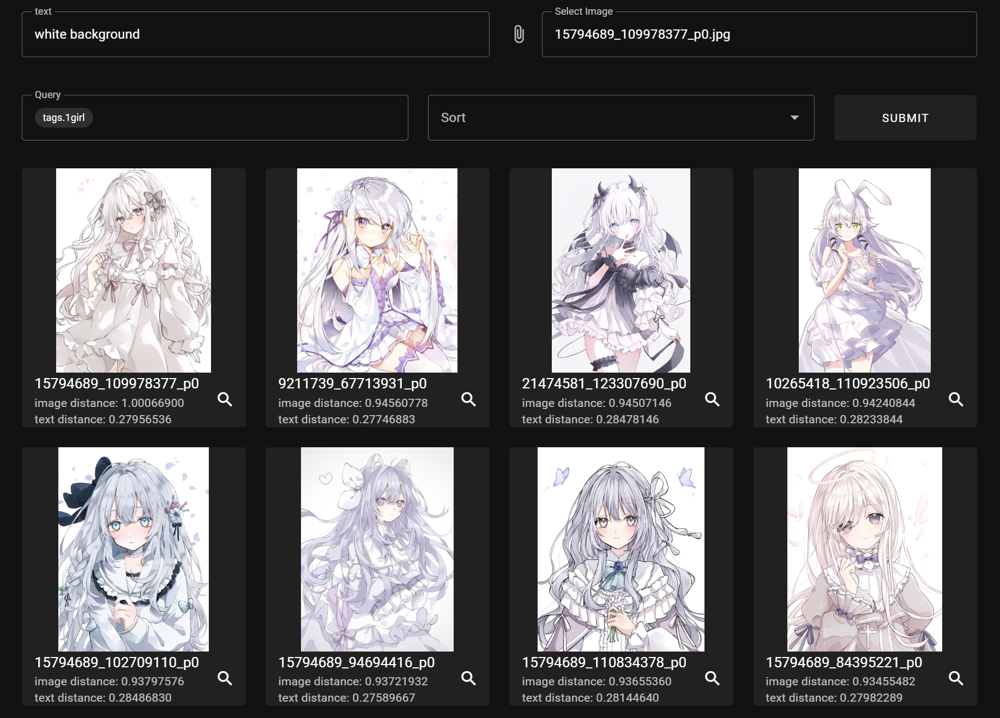

# PxIMSE

Local anime style image search based on [DeepDanbooru](https://github.com/KichangKim/DeepDanbooru), [CLIP](https://github.com/openai/CLIP) and [PaddleOCR](https://paddlepaddle.github.io/PaddleOCR/main/index.html)




### Supported file name formats

Images from [Pixiv](https://www.pixiv.net/), [PixivBatchDownloader](https://github.com/xuejianxianzun/PixivBatchDownloader), [PixEZ](https://github.com/Notsfsssf/pixez-flutter) ... , [Twitter Media Downloader](https://greasyfork.org/zh-CN/scripts/423001-twitter-media-downloader), [yande.re](https://yande.re/) or other sources, but without ID information:

- pixiv: {user_id}_{id}_p{index} **(Recommended)**
- pixiv: {id}_p{index}
- twitter: twitter_{user_name}(@{user_id})\_{date}\_{id}_photo
- yande.re: yande.re {id} {tags}

## Pre-requisites

- [Python 3.10+](https://www.python.org/downloads/)
- [Node.js 20+](https://nodejs.org/en/)
- [Nginx](https://nginx.org/)
- [Pre-trained DeepDanbooru model](https://github.com/KichangKim/DeepDanbooru/releases/tag/v3-20211112-sgd-e28)

### Databases

- [MongoDB](https://www.mongodb.com/)
- [Milvus](https://milvus.io/)

Refer to `docker-compose.yml`

### Dependencies

```sh
pip3 install -r requirements.txt
```

You might need to handle torch, tensorflow, and paddlepaddle manually

```sh
pnpm install
```

### configuration

Configure `python/config.yml` and `config.mjs`

## Usage

### 1. Import image information


Import image information, DeepDanbooru and OCR results to MongoDB
```sh
python import_images.py mongo
```

Import CLIP results to Milvus

```sh
python import_images.py milvus
```

Get information from Pixiv website (optional)
```sh
python import_images.py pixiv
```

Attempt to assign the username from an existing document in the database to a document with the same user ID that doesn't have a username (Indexes must be created on the username and userid fields) (optional)

```sh
python import_images.py update
```

### 2. Start Service


```sh
cd python
uvicorn api:app --host 0.0.0.0 --port 8000
```

```sh
pnpm dev
```

### Format of Query Criteria

**Exists:**  
tags.xxx  
tags1:xxx

**Does not exist:**  
!tags.xxx  
!tags1:xxx

**Greater than, less than, equal to, not equal to:**  
filesize;>1000000  
tags.xxx;<=0.9  
date;>2000-01-01&<2010-01-01  
likeCount;=100  
viewCount;!=200

**Text length:**  
textlen;>xx


tags are obtained from DeepDanbooru  
tags1 are retrieved from Pixiv website (For yandere, from the file name)


## Credits

Inspired by:

- [clip-image-search](https://github.com/atarss/clip-image-search)
